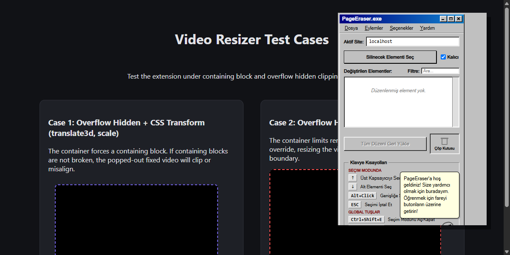
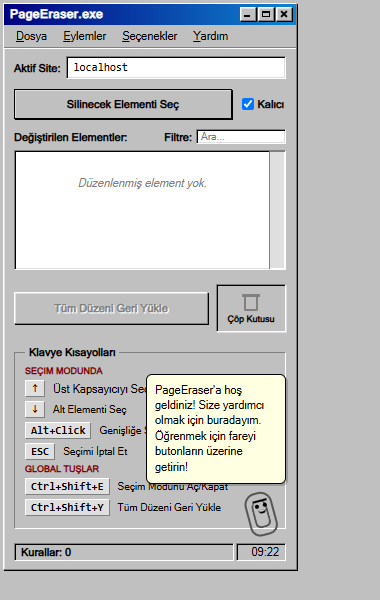
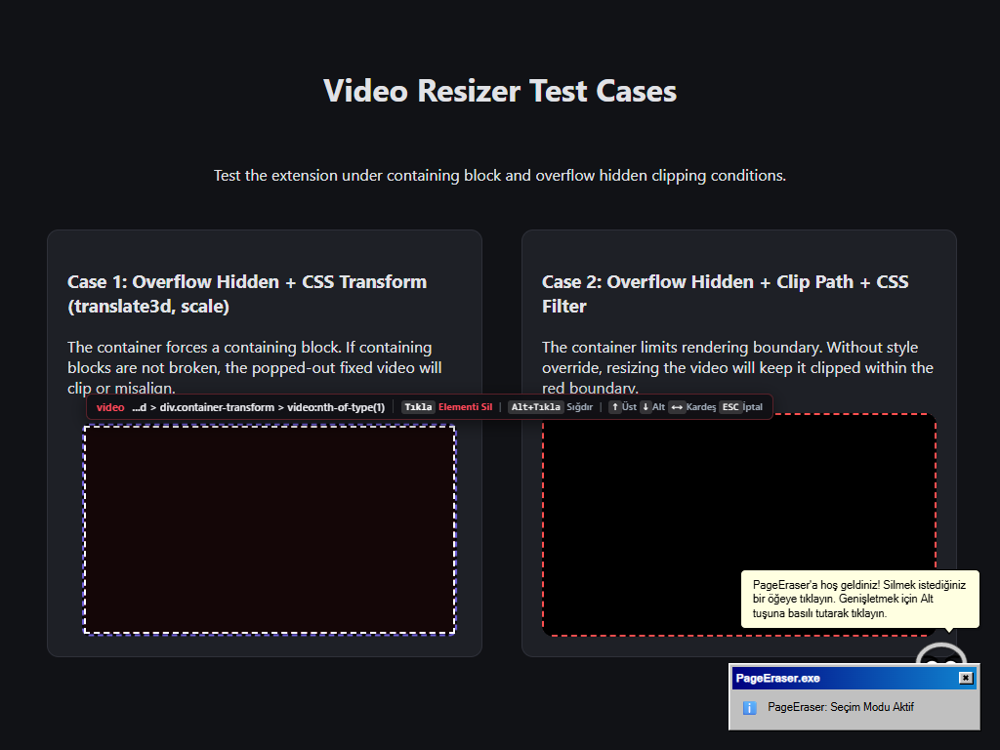
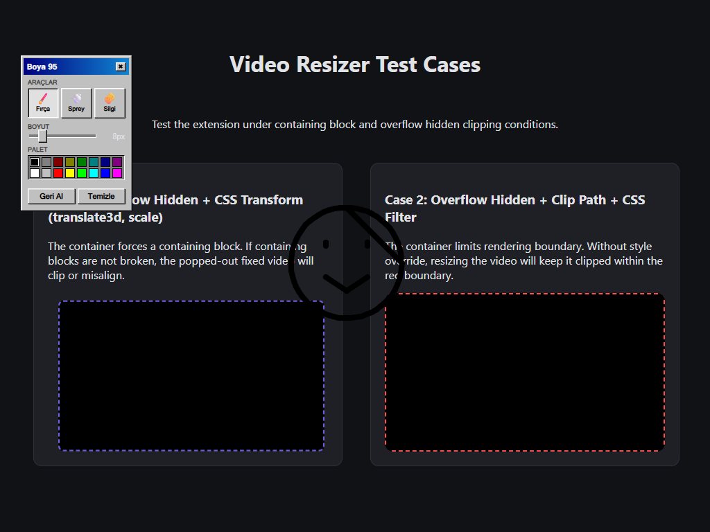
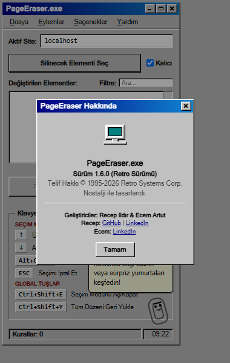

<div align="center">



<br />

# 🧹 PageEraser

**Interactively select and permanently remove any element from any webpage.**

[](https://chromewebstore.google.com/)
[]()
[]()
[]()

*A Chrome/Edge extension wrapped in a nostalgic Windows 95 aesthetic — because cleaning up the web should be fun.*

[Features](#-features) · [Installation](#-installation) · [Usage](#-usage) · [Keyboard Shortcuts](#-keyboard-shortcuts) · [Tech Stack](#-tech-stack) · [Contributing](#-contributing)

</div>

---

## 📸 Screenshots

<div align="center">



<br />
<em>The main popup — a fully functional Windows 95 application window with menus, toolbars, and Clippy.</em>

</div>

<details>
<summary><strong>🖼️ More Screenshots</strong></summary>

<br />

<div align="center">



*Selection Mode — Hover any element to highlight it, click to erase, Alt+Click to stretch.*

<br />



*Paintbrush 95 — A full drawing canvas overlay with brush, spray, and eraser tools.*

<br />



*Feature Overview — Smart selection, persistent rules, DOM navigation, and more.*

</div>

</details>

---

## ✨ Features

### 🎯 Core Functionality
| Feature | Description |
|---------|------------|
| **Smart Element Selection** | Click any element to erase it with a precision crosshair cursor |
| **Stretch to Full Width** | `Alt+Click` any element to stretch it to 100% width (remove max-width constraints) |
| **Persistent Rules** | Erased elements stay hidden across page reloads and browser restarts |
| **Per-Domain Storage** | Rules are scoped per website domain with optional subdomain support |
| **CSS Selector Engine** | Automatically generates robust CSS selectors with ID/class/nth-of-type fallbacks |
| **Inline Rule Editor** | Edit CSS selectors directly from the popup for fine-tuned control |
| **Import / Export** | Backup and restore your rules as JSON files across devices |

### 🧭 Advanced DOM Navigation
| Key | Action |
|-----|--------|
| `↑` | Select **parent** element |
| `↓` | Select **child** element (depth-first tree traversal) |
| `←` | Select **previous sibling** |
| `→` | Select **next sibling** |
| `ESC` | Cancel selection mode |

> The `↓` key uses intelligent tree traversal: it enters the first child, and if no children exist, automatically moves to the next sibling — so you never get stuck on leaf nodes.

### 🎨 Retro Windows 95 Theme
- **Authentic Win95 UI** — Beveled borders, sunken panels, gradient title bars
- **3 Color Themes** — Classic Teal, Blue, and Plum
- **High Contrast Mode** — WCAG-compliant accessibility option
- **Large Text Mode** — Scalable typography for readability
- **Retro Toast Notifications** — Win95-style notification windows with title bars

### 🖌️ Paintbrush 95 Mode
A full-featured transparent drawing overlay on any webpage:
- **Brush Tool** — Freehand drawing with adjustable size
- **Spray Can** — Classic MS Paint spray effect
- **Eraser** — Custom cursor eraser with adjustable size
- **16-Color Palette** — Authentic MS Paint color grid
- **Undo / Clear** — Full undo history (up to 20 states)

### 📎 Clippy Assistant
- **Contextual Tips** — Clippy reacts when you hover UI elements
- **Random Tips** — Click Clippy for useful PageEraser tips
- **Wink Animation** — Animated SVG paperclip with eye tracking
- **Bilingual Support** — Clippy speaks both English and Turkish
- **Chomp Animation** — Clippy "eats" erased elements with a chomping effect

### 🔊 Retro Sound Effects
All sounds are synthesized in real-time using the **Web Audio API** — no audio files needed:
- Windows 95 startup/shutdown jingles
- Element selection & erase effects
- Clippy chomp sounds
- Minesweeper click & explosion
- Paint brush swish
- Recycle bin crumple

### 🎮 Easter Eggs
- **💣 Minesweeper** — Click the retro computer screen in the About dialog
- **💀 Blue Screen of Death** — `Ctrl+Shift+B` triggers a fake BSOD with a reset option
- **🗑️ Drag & Drop Recycle Bin** — Drag rules to the Recycle Bin to restore them

### 🌍 Internationalization
Full bilingual support with dynamic locale switching:
- 🇬🇧 **English**
- 🇹🇷 **Türkçe**

---

## 🚀 Installation

### From Source (Developer Mode)

1. **Clone the repository**
   ```bash
   git clone https://github.com/rildir/PageEraser.git
   ```

2. **Open your browser's extension page**
   - Chrome: `chrome://extensions/`
   - Edge: `edge://extensions/`

3. **Enable Developer Mode** (toggle in the top-right corner)

4. **Click "Load unpacked"** and select the cloned `PageEraser` folder

5. **Pin the extension** to your toolbar for quick access

> [!TIP]
> No build step required! The extension is written in vanilla JS and runs directly from source.

### 🌐 Interactive Web-based Live Playground
PageEraser includes built-in Chrome Extension API mocks. This allows developers and reviewers to test the entire interface, features, themes, sound effects, and drawing canvas **directly in a standard browser tab** without installing the extension:
1. Start any static web server in the project root (e.g., `npx http-server -p 8080` or VS Code Live Server).
2. Open `http://localhost:8080/test.html` in your browser.
3. Open `http://localhost:8080/popup.html` (or open it as a popup/iframe) to control the page and enjoy the full interactive experience!

---

## 🎮 Usage

### Quick Start
1. Click the **PageEraser** icon in your toolbar (or press `Ctrl+Shift+E`)
2. **Hover** over any element on the page — it highlights with a red dashed border
3. **Click** to erase it, or **Alt+Click** to stretch it to full width
4. Use **arrow keys** to navigate the DOM tree for precision selection
5. Press **ESC** to exit selection mode

### Context Menu
Right-click any element on a page to access:
- **PageEraser: Erase Element** — Instantly hide the right-clicked element
- **PageEraser: Stretch Element** — Stretch it to max width

### Managing Rules
- Open the popup to see all modified elements for the current site
- **Filter** rules by typing in the search box
- **Edit** selectors inline for fine-tuning
- **Restore** individual elements or reset the entire site
- **Drag** rules to the Recycle Bin to restore them
- **Import/Export** rules as JSON backups via File menu

---

## ⌨️ Keyboard Shortcuts

### Global Shortcuts
| Shortcut | Action |
|----------|--------|
| `Ctrl+Shift+E` | Toggle Selection Mode |
| `Ctrl+Shift+Y` | Restore All Layout |
| `Ctrl+Shift+K` | Start Paintbrush 95 |
| `Ctrl+Z` | Undo last erased element (on page) |

### In Selection Mode
| Key | Action |
|-----|--------|
| `Click` | Erase highlighted element |
| `Alt+Click` | Stretch element to full width |
| `↑` | Select parent container |
| `↓` | Navigate down (child → sibling → parent's sibling) |
| `←` | Previous sibling element |
| `→` | Next sibling element |
| `ESC` | Cancel selection mode |

---

## 🏗️ Tech Stack

| Technology | Usage |
|-----------|-------|
| **Manifest V3** | Latest Chrome extension architecture |
| **Vanilla JavaScript** | Zero dependencies, no frameworks |
| **Web Audio API** | Real-time synthesized retro sound effects |
| **CSS3** | Advanced animations, transitions, and theming |
| **Chrome Storage API** | Persistent per-domain rule storage (10MB local) |
| **Chrome Context Menus API** | Right-click integration |
| **Chrome Commands API** | Global keyboard shortcuts |

---

## 📁 Project Structure

```
PageEraser/
├── manifest.json          # Extension manifest (V3)
├── background.js          # Service worker — commands, context menus, badges
├── content.js             # Content script — selection, erasing, DOM navigation
├── content.css            # Injected styles — highlighter, tooltips, toasts, clippy
├── popup.html             # Popup UI — Windows 95 themed interface
├── popup.css              # Popup styles — complete Win95 design system
├── popup.js               # Popup logic — rules management, theming, menus
├── audio.js               # Sound synthesizer — Web Audio API retro effects
├── locales.js             # i18n — English & Turkish translations
├── clippy.js              # Clippy assistant — contextual tips & animations
├── tour.js                # Onboarding — 3-step guided spotlight tour
├── minesweeper.js         # Easter egg — classic Minesweeper game
├── test.html              # Development test page with edge-case scenarios
├── icons/                 # Extension icons (16, 48, 128px)
│   ├── icon16.png
│   ├── icon48.png
│   └── icon128.png
└── screenshots/           # README assets
    ├── hero-banner.png
    ├── selection-mode.png
    ├── popup-window.png
    ├── paint-mode.png
    └── features-overview.png
```

---

## 🤝 Contributing

Contributions are welcome! Here's how to get started:

1. **Fork** the repository
2. **Create** a feature branch (`git checkout -b feature/amazing-feature`)
3. **Commit** your changes (`git commit -m 'Add amazing feature'`)
4. **Push** to the branch (`git push origin feature/amazing-feature`)
5. **Open** a Pull Request

### Development

```bash
# Clone the repo
git clone https://github.com/rildir/PageEraser.git

# Load as unpacked extension in Chrome
# No build step needed — edit and reload!

# Test with the included test page
# Open test.html in browser with the extension loaded
```

> [!NOTE]
> The extension is built with **zero dependencies**. Just clone and load — no `npm install` required.

---

## 👨‍💻 Authors

<table>
  <tr>
    <td align="center">
      <strong>Recep Ildır</strong><br/>
      <a href="https://github.com/rildir">GitHub</a> ·
      <a href="https://www.linkedin.com/in/recep-ildir/">LinkedIn</a>
    </td>
    <td align="center">
      <strong>Ecem Artut</strong><br/>
      <a href="https://www.linkedin.com/in/ecemartut/">LinkedIn</a>
    </td>
  </tr>
</table>

---

## 📄 License

This project is licensed under the **MIT License** — see the [LICENSE](LICENSE) file for details.

---

<div align="center">

<sub>Built with ❤️ and a healthy dose of 90s nostalgia.</sub>

<br />

**⭐ Star this repo if you found it useful!**

</div>
